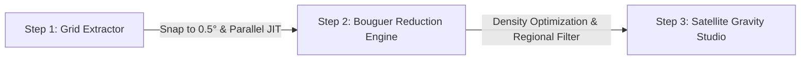

# TOPEX Interactive 2.0: Satellite Gravity & Bathymetry Studio

[](https://topex-interactive.yufajjiru.work)
[](https://www.typescriptlang.org/)
[](https://workers.cloudflare.com/)
[](https://hono.dev/)
[](https://react.dev/)
[](https://developer.mozilla.org/en-US/docs/Web/API/WebGL_API)

Modern fullstack geophysical exploration platform for extracting, processing, and analyzing global seafloor bathymetry and satellite altimetry-derived gravity anomaly fields from Scripps Institution of Oceanography, UC San Diego (*Smith & Sandwell, 1997; Sandwell et al., 2014*).

- **Production URL:** [https://topex-interactive.yufajjiru.work](https://topex-interactive.yufajjiru.work)
- **Workers Mirror:** [https://topex-interactive.luthfiyufajjiru.workers.dev](https://topex-interactive.luthfiyufajjiru.workers.dev)

---

## 3-Step Geophysical Workflow



### 1. Step 1: Universal Grid Extractor & JIT Streamer
- **Interactive Global Map**: Draw bounding boxes on Google Earth Satellite imagery with 0-meridian wrap support and live coordinate synchronization.
- **Canonical 0.5° Snap-to-Grid**: Snaps any arbitrary bounding box to universal $0.5^\circ \times 0.5^\circ$ discrete tiles, guaranteeing $100\%$ global cache reuse.
- **Structural Integrity Validator**: Inspects incoming sounding streams against theoretical point-density thresholds to quarantine truncated CGI streams and trigger automatic self-healing retries.
- **Resumable Extraction**: Interrupted or rate-limited jobs display an amber warning with a **"Continue Extraction"** button that resumes missing tiles in $0\text{ ms}$ from IndexedDB.

### 2. Step 2: Complete Bouguer Reduction & Parasnis Regression
- **Continental & Marine Slab Reduction**: Calculates complete Bouguer anomalies compensating for crustal slabs ($h \ge 0$) and seawater mass deficiencies ($h < 0$) using standard Bullard-A reduction formulas.
- **Interactive Nettleton / Parasnis Density Regression**: Fits $d(\text{FAA})/dh$ linear regressions ($R^2$, empirical crustal density $\rho_c$, and density contrast $\Delta\rho$) with dynamic scatter plots and parameter synchronization.

### 3. Step 3: Satellite Gravity Studio & 2D Cross-Section Profiler
- **Tri-Map Synchronized Viewports**: Simultaneous raster analysis of **Topography/Bathymetry (GEBCO)**, **Free-Air Gravity Anomaly (Coolwarm)**, and **Complete Bouguer / Regional / Residual Anomaly (Viridis)**.
- **Live 2D Transect Profiler**: Freely draw, drag, and compare cross-sections ($A \to A'$, $B \to B'$) with multi-line stacking and synchronous distance-anomaly elevation plots.
- **Regional-Residual Separation**: Griffin (1949) moving average windows, Gaussian spatial low-pass filters, and 1st/2nd-order polynomial trend surface removals.

---

## WebGL & Shader Hardware Acceleration

### 1. GPU vs. CPU Architecture
Computing 2D potential field spatial interpolation (Bicubic Spline, Thin Plate Minimum Curvature, Bilinear, IDW) across large grids ($> 100{,}000\text{ soundings}$) in pure JavaScript can lock the CPU event loop.

To eliminate main-thread stutter, the Studio utilizes **Hardware-Accelerated WebGL/Canvas Rasterization**:
* **Vectorized Single-Pass Matrix Builder (`buildAllRegularGrids`)**: Coordinates, unique sorted axes, and cell index maps are generated in a single pass for all 5 fields simultaneously ($5\times$ performance improvement over multi-pass loops).
* **Asynchronous Control Locking (`isRendering`)**: While rasterization or regional filtering executes, all dropdowns, sliders, and export controls are temporarily locked with an active indicator badge (`Rendering Grid & Applying Filter...`), preventing race conditions and UI lockup.

### 2. WebGL Capability Detection & Download Fallback
If a client browser or mobile device does not meet the minimum WebGL hardware acceleration standard (e.g. disabled GPU drivers or maximum texture size $< 1024\text{px}$):
* **Automatic Fallback Screen (`WebGLFallbackView.tsx`)**: The UI gracefully detects capability limits and renders a clean export console instead of crashing.
* **Direct Export Suite**: Enables instant direct downloads of all computed data without requiring rasterization:
  * **Soundings Table (.CSV)**
  * **Oasis Montaj Geosoft Grid (.XYZ)**
  * **Geosoft Grid (.GXF)**
  * **Structured JSON Dataset (.JSON)**

---

## Multi-Tier Cache & Protection Matrix

| Layer | Technology | Retention / Limit | Latency | Purpose |
| :--- | :--- | :--- | :--- | :--- |
| **L1 Browser Memory** | In-Memory `Map` | Active Tab Session | **$0\text{ ms}$** | Eliminates redundant calculations on re-render |
| **L2 Browser IndexedDB** | `IndexedDB` (`topex_interactive_cache_v2`) | 7 Days (Persistent) | **$< 2\text{ ms}$** | Persists soundings offline across page refreshes |
| **L3 Cloudflare Edge** | Cloudflare Cache API | 30 Days (Global PoPs) | **$< 15\text{ ms}$** | Serves cached tiles without hitting UCSD upstream |
| **Edge Rate Limiter** | Cloudflare Workers Binding | 120 req / 60s per IP | Global Edge | Shields origin from scraping & socket exhaustion |
| **Upstream Stagger** | Single-Flight In-Flight Mutex | Dynamic Socket Pool | Upstream | Deduplicates identical requests & staggers sockets |

---

## Export Formats

- **Oasis Montaj / Geosoft XYZ (`.xyz`)**: Industry-standard geophysical format for mineral, oil, and gas potential-field software.
- **Geosoft Grid (`.gxf`)**: Standard ASCII matrix grid file for GIS and Geosoft Oasis Montaj grid imaging.
- **Composite Report Plate (`.png`)**: Single-image publication-ready figure containing all 3 maps, active 2D cross-section profile, colormap scales, and geophysical metadata.
- **GeoJSON (`.geojson`)**: 3D Point features with attributes for drag-and-drop into QGIS and ArcGIS.
- **GMT ASCII Grid (`.xyz`)**: Generic Mapping Tools table format.
- **Tabular Data**: `.csv`, `.json`, `.kml`.

---

## Local Development

```bash
# Clone the repository
git clone git@github.com:luthfiyufajjiru/topex-interactive.git
cd topex-interactive

# Install dependencies
npm install

# Start fullstack Vite + Hono dev server
npm run dev
```

Visit `http://localhost:5173/` in your browser.

---

## Deployment to Cloudflare Workers

```bash
# 1. Build TypeScript and Vite bundle
npm run build

# 2. Deploy to Cloudflare Workers
npx wrangler deploy
```

---

## Scientific Attribution & References

Data source: Scripps Institution of Oceanography, University of California San Diego.
* **Smith, W. H. F., & Sandwell, D. T. (1997).** *Global sea floor topography from satellite altimetry and ship depth soundings.* Science, 277(5334), 1956-1962.
* **Sandwell, D. T., et al. (2014).** *New global marine gravity model from CryoSat-2 and Jason-1 reveals buried tectonic structure.* Science, 346(6205), 65-67.
* **Nettleton, L. L. (1939).** *Determination of density for reduction of gravimeter observations.* Geophysics, 4(3), 176-183.
* **Parasnis, D. S. (1952).** *A study of rock densities in the English Midlands.* Geophysical Supplements to the Monthly Notices of the Royal Astronomical Society, 6(5), 252-271.
* **Griffin, W. R. (1949).** *Residual gravity in theory and practice.* Geophysics, 14(1), 39-56.

---

## License

MIT License &copy; 2026 TOPEX Interactive Contributors.
