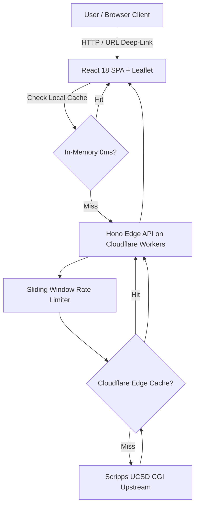

# Topex Interactive Downloader

[](https://topex-interactive.yufajjiru.work)
[](https://www.typescriptlang.org/)
[](https://workers.cloudflare.com/)
[](https://hono.dev/)
[](https://react.dev/)

Modern fullstack interactive tool for extracting, visualizing, and exporting global seafloor topography (bathymetry) and marine gravity anomaly grids from Scripps Institution of Oceanography, UC San Diego (Smith & Sandwell, 1997; Sandwell et al., 2014).

- Custom Domain: [https://topex-interactive.yufajjiru.work](https://topex-interactive.yufajjiru.work)
- Cloudflare Workers Mirror: [https://topex-interactive.luthfiyufajjiru.workers.dev](https://topex-interactive.luthfiyufajjiru.workers.dev)

---

## Features

- **Google Earth Satellite Basemap**: High-resolution default imagery layer with Leaflet Draw rectangle selection, 0-meridian wrap protection, and coordinate synchronization.
- **Universal Canonical Snap-to-Grid (0.5 Degree Tiles)**: Universal global discrete tiling (0.5 degree x 0.5 degree cells) that guarantees 100% cache sharing across overlapping user selections worldwide.
- **Just-In-Time (JIT) Parallel Streaming**: Dispatches 6 concurrent worker pipelines with soundings streaming directly into the visible grid in real-time.
- **Non-Blocking Progress and Cancellation**: Live streaming progress banner with soundings counter and cancellation control without blocking modal backdrops.
- **Multi-Layer Edge and Client Caching**:
  - Browser Memory: Instant 0ms retrieval for previously requested tiles.
  - Cloudflare Edge Cache: Cached global bathymetric tiles with sub-15ms latency.
  - Sliding-Window Rate Limiter: 300 requests per minute edge protection.
- **Geospatial and Scientific Multi-Format Exporter**:
  - GeoJSON (`.geojson`): 3D Point features (`[lon, lat, elev]`) with attributes for direct drag-and-drop into QGIS and ArcGIS.
  - ASCII Grid (`.xyz`): Standard GMT (Generic Mapping Tools) space-delimited bathymetry format.
  - KML (`.kml`): Google Earth 3D placemark soundings.
  - CSV (`.csv`): Universal tabular format for Excel, Python Pandas, and R.
  - JSON (`.json`), YAML (`.yaml`), XML (`.xml`).
- **Shareable URL Deep-Linking and Import**:
  - Real-time URL query parameter synchronization (`?north=-8&south=-9&west=114.5&east=115.5&gravity=true`).
  - One-click copy link, copy coordinate snippet, and multi-format paste import.

---

## Architecture



- **Frontend**: React 18, TypeScript, Vite, Leaflet, Leaflet Draw, Lucide Icons.
- **Backend / Edge Proxy**: Cloudflare Workers, Hono, Zod, Cloudflare Cache API.
- **Data Source**: Scripps Institution of Oceanography, UC San Diego (`https://topex.ucsd.edu/cgi-bin/get_data.cgi`).

---

## Local Development

```bash
# Clone the repository
git clone git@github.com:luthfiyufajjiru/topex-interactive.git
cd topex-interactive

# Install dependencies
npm install

# Start fullstack Vite + Hono dev server
npm run dev
```

Visit `http://localhost:5173/` in your browser.

---

## Deployment to Cloudflare Workers

```bash
# 1. Login to Cloudflare
npx wrangler login

# 2. Build and deploy
npm run deploy
```

---

## Scientific Attribution

Data belongs to Scripps Institution of Oceanography, University of California San Diego (Smith & Sandwell, 1997; Sandwell et al., 2014).
- Odd elevation values represent ship sounding constraints.
- Even values are predicted from satellite altimetry gravity anomalies.

---

## Author

Created by [Luthfi Yufajjiru](https://www.linkedin.com/in/yufajjiru/) (2022-2026).
