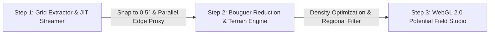

# TOPEX Interactive 2.0: Satellite Gravity & Bathymetry Studio

[](https://topex-interactive.yufajjiru.work)
[](https://www.typescriptlang.org/)
[](https://workers.cloudflare.com/)
[](https://hono.dev/)
[](https://react.dev/)
[](https://developer.mozilla.org/en-US/docs/Web/API/WebGL_API)

Modern fullstack geophysical exploration platform for extracting, processing, and analyzing global seafloor bathymetry and satellite altimetry-derived gravity anomaly fields from Scripps Institution of Oceanography, UC San Diego (*Smith & Sandwell, 1997; Sandwell et al., 2014*).

- **Production URL:** [https://topex-interactive.yufajjiru.work](https://topex-interactive.yufajjiru.work)
- **Workers Mirror:** [https://topex-interactive.luthfiyufajjiru.workers.dev](https://topex-interactive.luthfiyufajjiru.workers.dev)

---

## 3-Step Geophysical Workflow



### 1. Step 1: Universal Grid Extractor & JIT Streamer
- **Interactive Global Map**: Bounding-box selection on Google Earth satellite & nautical bathymetry imagery with seamless 0-meridian wrap support.
- **Canonical 0.5° Snap-to-Grid**: Snaps arbitrary bounding boxes to universal $0.5^\circ \times 0.5^\circ$ discrete tiles, guaranteeing $100\%$ global edge cache reuse.
- **Resumable Stream Recovery**: Self-healing validation quarantines truncated CGI streams and resumes missing tiles in $0\text{ ms}$ from IndexedDB.

### 2. Step 2: Complete Bouguer Reduction & Parasnis Regression
- **Continental & Marine Bullard-A Reduction**: Computes Complete Bouguer Anomalies (CBA) compensating for crustal slabs ($h \ge 0$) and seawater mass deficiencies ($h < 0$).
- **Hayford-Bowie & Hammer Terrain Correction**: Integrates regional terrain prism corrections into CBA with dynamic marine density adjustments.
- **Interactive Nettleton / Parasnis Regression**: Real-time least-squares $d(\text{FAA})/dh$ fitting ($R^2$, empirical crustal density $\rho_c$, and density contrast $\Delta\rho$) with dynamic scatter plots.

### 3. Step 3: Satellite Gravity Studio & 2D Geophysical Profiler
- **Tri-Map Synchronized Viewports**: Real-time synchronized rasterization of **Topography/Bathymetry (GEBCO)**, **Free-Air Gravity Anomaly (FAA)**, and **Complete Bouguer / Residual Anomaly (CBA)**.
- **2D Potential Field Calculus Profiler**:
  - **First Horizontal Derivative (FHD)**: Identifies fault boundary inflection contacts.
  - **Second Vertical Derivative (SVD)**: Solves Laplace's equation ($\nabla^2 g = 0 \implies \frac{\partial^2 g}{\partial z^2} = -\frac{\partial^2 g}{\partial x^2}$) for high-resolution edge detection.
  - **Tilt Derivative (TDR)**: AGC phase angle filter ($\theta = \tan^{-1}[\text{VDR}/\text{THDR}]$) normalizing amplitude decay for deep and shallow basement depth estimation ($h = \Delta x_{45^\circ}$).
- **Elkins (1951) Fault Classification Engine**: Automated real-time structural analysis classifying normal faults, thrust/reverse faults, and strike-slip/transtensional steps from SVD dipole ratios.
- **Sounding Picks Inspection & Reporting**: Pin multiple sounding stations along transects with interactive SVG HUD, dynamic column filtering, and high-DPI PNG/CSV composite report exports.

---

## WebGL 2.0 & GLSL Hardware Shader Acceleration

### 1. High-Throughput GPU Rasterization & Texture Streaming
Processing and rendering 2D potential field grids ($>100{,}000\text{ soundings}$) in real-time requires GPU parallelization to prevent main-thread UI stutter:
* **Custom GLSL Fragment Shaders**: Color mapping (Viridis, Coolwarm, Turbo, Jet, Spectral, Earth/Ocean Bathymetry) is computed entirely on the GPU via custom GLSL fragment shaders.
* **Vectorized Single-Pass Matrix Pipeline**: Coordinates, sorted spatial axes, and cell index maps are generated in a single pass for all 5 potential fields simultaneously ($5\times$ performance gain).
* **Hardware Bilinear & Bicubic Filtering**: Leverages WebGL 2.0 32-bit floating-point textures (`OES_texture_float_linear` / `EXT_color_buffer_float`) for zero-latency raster resampling during viewport pan and zoom.

### 2. WebGL Capability Detection & Headless Fallback
If a client environment lacks full WebGL 2.0 acceleration (e.g. software rendering or mobile low-power mode):
* **Automatic Fallback Screen (`WebGLFallbackView.tsx`)**: Gracefully detects GPU limits and switches to headless export mode without crashing.
* **Direct Export Suite**:
  * **Oasis Montaj / Geosoft Grid (.XYZ)**
  * **Surfer ASCII Grid (.GRD)**
  * **Geosoft Grid (.GXF)**
  * **High-DPI 2D Cross-Section Plates (.PNG)**
  * **GeoTIFF / GeoJSON (.geojson)**
  * **CSV Soundings Table (.CSV)**

---

## Multi-Tier Cache & Protection Matrix

| Layer | Technology | Retention / Limit | Latency | Purpose |
| :--- | :--- | :--- | :--- | :--- |
| **L1 Browser Memory** | In-Memory `Map` | Active Tab Session | **$0\text{ ms}$** | Eliminates redundant calculations on re-render |
| **L2 Browser IndexedDB** | `IndexedDB` (`topex_interactive_cache_v2`) | 7 Days (Persistent) | **$< 2\text{ ms}$** | Persists soundings offline across page refreshes |
| **L3 Cloudflare Edge** | Cloudflare Cache API | 30 Days (Global PoPs) | **$< 15\text{ ms}$** | Serves cached tiles without hitting UCSD upstream |
| **Edge Rate Limiter** | Cloudflare Workers Binding | 120 req / 60s per IP | Global Edge | Shields origin from scraping & socket exhaustion |
| **Upstream Stagger** | Single-Flight In-Flight Mutex | Dynamic Socket Pool | Upstream | Deduplicates identical requests & staggers sockets |

---

## Export Formats

- **Oasis Montaj / Geosoft XYZ (`.xyz`)**: Industry-standard geophysical format for mineral, oil, and gas potential-field software.
- **Geosoft Grid (`.gxf`)**: Standard ASCII matrix grid file for GIS and Geosoft Oasis Montaj grid imaging.
- **Composite Report Plate (`.png`)**: Single-image publication-ready figure containing all 3 maps, active 2D cross-section profile, colormap scales, and geophysical metadata.
- **GeoJSON (`.geojson`)**: 3D Point features with attributes for drag-and-drop into QGIS and ArcGIS.
- **GMT ASCII Grid (`.xyz`)**: Generic Mapping Tools table format.
- **Tabular Data**: `.csv`, `.json`, `.kml`.

---

## Local Development

```bash
# Clone the repository
git clone git@github.com:luthfiyufajjiru/topex-interactive.git
cd topex-interactive

# Install dependencies
npm install

# Start fullstack Vite + Hono dev server
npm run dev
```

Visit `http://localhost:5173/` in your browser.

---

## Deployment to Cloudflare Workers

```bash
# 1. Build TypeScript and Vite bundle
npm run build

# 2. Deploy to Cloudflare Workers
npx wrangler deploy
```

---

## Scientific Attribution & References

Data source: Scripps Institution of Oceanography, University of California San Diego.
* **Smith, W. H. F., & Sandwell, D. T. (1997).** *Global sea floor topography from satellite altimetry and ship depth soundings.* Science, 277(5334), 1956-1962.
* **Sandwell, D. T., et al. (2014).** *New global marine gravity model from CryoSat-2 and Jason-1 reveals buried tectonic structure.* Science, 346(6205), 65-67.
* **Nettleton, L. L. (1939).** *Determination of density for reduction of gravimeter observations.* Geophysics, 4(3), 176-183.
* **Parasnis, D. S. (1952).** *A study of rock densities in the English Midlands.* Geophysical Supplements to the Monthly Notices of the Royal Astronomical Society, 6(5), 252-271.
* **Griffin, W. R. (1949).** *Residual gravity in theory and practice.* Geophysics, 14(1), 39-56.

---

## License

MIT License &copy; 2026 TOPEX Interactive Contributors.
